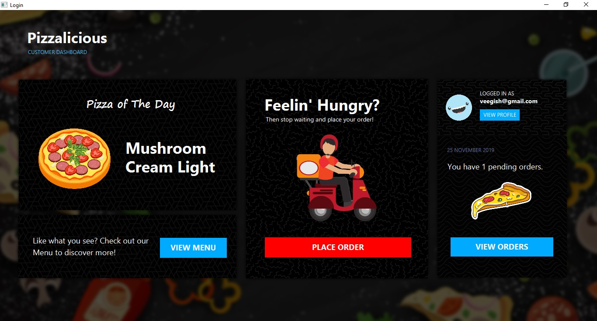
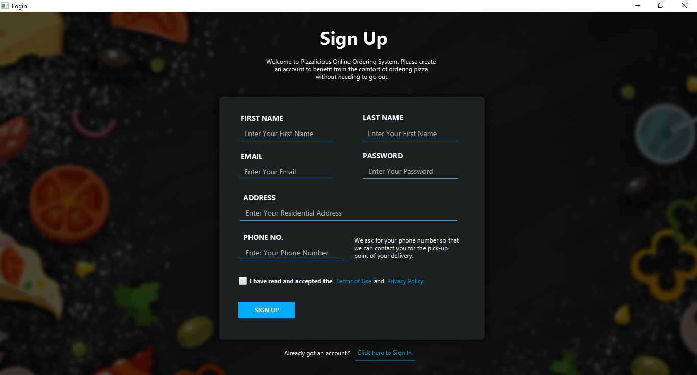
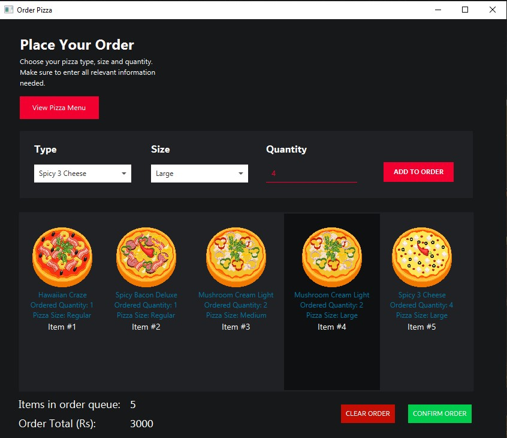

### Project Description
This is our assignment submission for CSE 3122Y - Distributed and Cloud Computing Semester 1, a basic online pizza ordering application consisting of a TCP server and a JavaFX client to allow customers to place their orders. An additional unfinished client for managing orders is included as well.

This assignment was done in less than 2 days therefore there are some key aspects missing such as form validation.

### Project Structure

```markdown
├───CustomerClient
│   ├───Controllers
│   └───FXMLUserInterfaces
│       ├───Css
│       └───Images
├───ManagerClient
│   ├───Controllers
│   └───FXMLUserInterfaces
│       └───Images
├───Model 
└───Server
```
### How to run this application
* Make sure you have a JDK version with JavaFX
* Clone this repo
```markdown
git clone https://github.com/VEEGISHx/Pizzalicious.git
```
* Run the `Server` class found in the Server package
* Run the main class found in the `CustomerClient` package

### Team Members & Task Distribution
* Yashveer Jadoo ([Github](https://github.com/Yaashveer)) - Server Backend
* Ashray Bhagbut - Server Backend
* Veegish Ramdani - Front End + Server Backend linking

### Screenshots

#### Dashboard



#### Sign Up



#### Order

